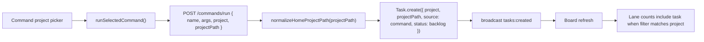

# Command Launch Project Visibility Design

## Problem

Launching the local `/import-all` command from the skill/command panel appears to succeed, but the board can still show zero queued or in-progress tasks. The task is actually created and spawned; it is hidden by project filtering.

Observed on June 30, 2026:

- The console showed `Launched /import-all — see the board.`
- The board was filtered to `digibot`, which had two review tasks and no in-progress tasks.
- The daemon had an active command task:
  - task id: `0752454fc7874e1a9f25ab36`
  - title: `[command] /import-all`
  - source: `command`
  - status: `in_progress`
  - agent PID: `96340`
  - project: `ops`
  - projectPath: `/Users/irvcassio`

The launch path therefore works at the task/spawn layer. The user-facing bug is that the command picker gathers a selected project path, but the command launch API contract does not carry the selected project identity. The server persists command tasks as `project: "ops"`, so a board filtered to the chosen project hides the new task while the success message says to look at the board.

## Current Behavior

In the up-to-date console UI, the command project picker keeps command project state in the multi-picker state for prefix `cmd`. That state includes a project name and the hidden `commandPath`.

The command runner posts only:

```json
{
  "name": "import-all",
  "args": "",
  "projectPath": "/Users/irvcassio"
}
```

The server route `POST /commands/run` creates the task with:

```ts
project: "ops",
projectPath,
source: "command",
status: "backlog"
```

The board groups tasks by `task.project` when `state.selectedProject` is set. A task created under `ops` is invisible when the board is filtered to `digibot`, `hivematrix`, or another selected project.

## Goals

- Command-created tasks preserve the selected project name and path together.
- A successful command launch is visible or at least truthfully described under the active board filter.
- The fix applies to local slash commands and folder skills launched through `/commands/run`.
- Server-side behavior remains safe for custom folders and older clients that do not send `project`.
- Tests fail first for the current contract hole, then pass after the implementation.

## Non-Goals

- Do not change instruction-library skill runs under `POST /skills/:name/run`.
- Do not change command discovery under local Claude profile directories.
- Do not alter scheduler routing, model selection, or agent spawn behavior.
- Do not auto-archive old command tasks or change task retention.

## Approaches Considered

### Recommended: Carry Project Identity Through `/commands/run`

Have the command UI post both `project` and `projectPath`. The server validates and persists the optional project name, falling back to `"ops"` only when no project is supplied.

Trade-offs:

- Best data correctness: task metadata matches the operator's selected working context.
- Keeps filtering, counts, task detail, telemetry, and audit views consistent.
- Requires a small API contract update and tests on both the UI payload and server task creation.

### Server-Side Path Inference

Leave the UI payload unchanged and have the server infer `project` by matching `projectPath` against discovered projects.

Trade-offs:

- Fewer UI changes.
- Adds hidden coupling from command execution to project discovery.
- Can mislabel custom folders, duplicate paths, stale discovery cache entries, or paths that intentionally run from `$HOME`.

### UI-Only Visibility Fix

Keep command tasks under `ops`, but change the UI to clear the board filter, switch to `ops`, or display a link/status saying the task was created under `ops`.

Trade-offs:

- Addresses the immediate "where did it go?" confusion.
- Leaves incorrect task metadata in persistence and downstream metrics.
- Does not help mobile/API clients or future non-console command launchers.

## Design

Use the recommended contract fix, plus a small success-message guard.

### Console Payload

`runSelectedCommand()` should read the selected command project from the same state that controls the command picker.

For the up-to-date multi-picker UI:

```ts
const cmdProject = _mpS("cmd");
const projectName = cmdProject.name || "";
const projectPath = ((document.getElementById("commandPath") || {}).value || "$HOME").trim() || "$HOME";

body: JSON.stringify({
  name: c.invokeName,
  args,
  project: projectName || undefined,
  projectPath,
})
```

For older source snapshots that still use `#commandProject`, use the selected option value as `project`.

Custom-folder command launches should still send a project name. The existing multi-picker derives one from the folder basename, for example `~/work/foo` becomes `foo`. That is acceptable because the board needs a stable label, and the path remains the source of truth for execution.

### Server Route

`POST /commands/run` should accept an optional `project` field:

```ts
const project = typeof body.project === "string" && body.project.trim()
  ? body.project.trim()
  : "ops";
```

Then create the task with:

```ts
project,
projectPath,
source: "command",
output: { command: cmd.invokeName, kind: cmd.kind },
```

The route should keep existing validation for `projectPath` through `normalizeHomeProjectPath()`. Do not reject missing `project`; older clients should still work and fall back to `ops`.

### Success State

After a command launch returns `{ task }`, the UI should make the task's location obvious:

- If no board filter is active, keep the existing success text.
- If the active board filter equals `task.project`, keep the existing success text.
- If the active board filter differs from `task.project`, show:

```text
Launched /import-all in ops — current board filter is digibot.
```

Use text only for the first fix. Do not silently switch the user's board filter; surprising navigation would be worse than the current confusion. A later enhancement can add an explicit "Show project" action if the command status component grows an inline-action pattern.

## Data Flow



## Tests

Add tests before implementation.

### Console Contract Test

File: `src/daemon/server.test.ts` or `src/daemon/console.test.ts`

Extend the existing command launcher HTML contract test so it fails unless the command runner sends both fields:

- `projectPath: projectPath`
- `project: ...`

For the up-to-date multi-picker UI, assert the command runner reads `_mpS("cmd")` or equivalent command-picker state rather than the New Task picker state.

### Server Route Test

Preferred shape: start `createDaemonServer()` with a test database and a temporary local command catalog, then post to `/commands/run`.

Assertions:

- When the request body includes `{ project: "digibot", projectPath: "$HOME/digibot" }`, the created task has `project === "digibot"`.
- `projectPath` is still normalized under the current test `$HOME`.
- Older request bodies without `project` still create `project === "ops"`.
- Requests with invalid paths still fail with 400 and do not create a task.

### Board Visibility Test

Add a small console rendering/contract test if the current harness supports it:

- Given `state.selectedProject === "digibot"` and a returned task with `project === "ops"`, the command success text must mention both `ops` and `digibot`.
- Given matching or empty filter, the normal success text is acceptable.

If the console tests are still regex-based, keep the assertion narrow: verify there is a helper that compares `state.selectedProject` with `d.task.project` after command launch.

## Verification

Run the normal HiveMatrix gates after implementation:

```bash
npm run typecheck
npm test
node scripts/scope-wall.mjs
```

This is not a local-model feature, so `npx tsx scripts/qwen-readiness.mts` is not required unless the implementation touches local-model files.

## Rollout Notes

- Existing command tasks under `ops` should not be migrated. They accurately reflect the older behavior and are already complete or in progress.
- The fix is backward compatible: old clients that omit `project` continue creating `ops` command tasks.
- The success-message guard helps immediately if any future producer creates a task outside the active board filter.

## Implementation Decision

Use the text-only success message in this change. Do not add a "Show project" action in the first implementation.
