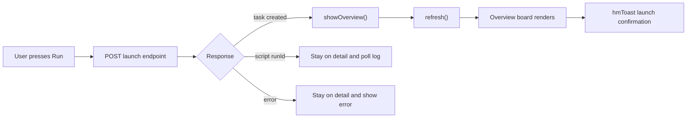

# Command Launch Return To Overview Design

## Problem

After launching a local slash command such as `/import-all`, the console stays on the command detail form. The form then shows `Launched /import-all — see the board.` while the user is still on the launch page, not the board/Overview page. This makes the launch feel unfinished, especially when paired with project filtering: the process may be running, but the user has to manually click `← Overview` to verify it.

Observed on June 30, 2026:

- The command detail page remained open after pressing `Run`.
- The status text said `Launched /import-all — see the board.`
- The task had already been created and spawned.

The expected interaction is: once a task-producing launch succeeds, the launch form is done. The console should return to Overview, refresh the board, and show a lightweight confirmation there.

## Goals

- Return to Overview automatically after a successful task-producing command launch.
- Apply the same behavior to instruction skills that create tasks.
- Keep the user on the current detail form for errors, validation failures, and script skills that need an in-panel run log.
- Use existing console primitives such as `showOverview()`, `refresh()`, and `hmToast()` instead of adding a new navigation system.
- Preserve active board filters; do not silently switch projects.

## Non-Goals

- Do not auto-open the newly launched task detail. The user asked to return to Overview, not to the task transcript.
- Do not clear or change the board's active project filter.
- Do not alter scheduler, task creation, model routing, or command discovery behavior.
- Do not replace the existing script-skill log polling UI.

## Approaches Considered

### Recommended: Return To Overview Plus Toast

After the API returns a created task, clear the selected command/skill detail state by calling `showOverview()`, refresh the board, and show a toast such as `Launched /import-all`.

Trade-offs:

- Matches the mental model of submitting a launch form.
- Uses established UI patterns already present in the console.
- Keeps the board as the canonical place to inspect active work.
- Requires only a small helper and targeted tests.

### Select The Newly Created Task

After launch, navigate directly to the new task detail transcript.

Trade-offs:

- Useful for immediate log inspection.
- Violates the requested behavior of returning to Overview.
- Can feel jumpy because the transcript may be nearly empty during the first seconds after spawn.

### Stay On Form But Improve The Message

Keep the current page and replace the message with stronger wording or a link.

Trade-offs:

- Least code.
- Still leaves the user on a stale form after the only meaningful action has completed.
- Keeps the command detail page acting like a status page, which it is not.

## Design

Use the recommended behavior for task-producing launches.

Introduce a tiny launch-success helper in the console script:

```ts
async function afterTaskLaunch(label, task) {
  showOverview();
  await refresh();
  const project = task && task.project ? " in " + task.project : "";
  hmToast("Launched " + label + project, "ok");
}
```

The implementation may adjust exact parameter names to fit the current source, but the helper should centralize the behavior so command and instruction-skill launches do not drift.

### Local Commands

In `runSelectedCommand()` or the older `runCommand()` equivalent:

- Keep the existing busy state while the request is pending.
- On `{ task }`, call `afterTaskLaunch("/" + c.invokeName, d.task)`.
- Do not leave the success message only inside `#skRunStatus` or `#commandResult`, because that element disappears when Overview is shown.
- On `{ error }` or thrown fetch errors, stay on the command detail form and show the error there.

### Instruction Skills

For library instruction skills that return `{ kind: "instruction", task }`:

- Call `afterTaskLaunch("[skill] " + skillName, d.task)`.
- Treat them the same as commands because they create board tasks.

### Script Skills

For script skills that return `{ kind: "script", runId }`:

- Stay on the skill detail page.
- Keep polling and showing the script log in the detail panel.

The detail panel is the correct status surface for script skills because no board task is created.

### Board Filter Interaction

This design preserves whatever project filter is active. It relies on the companion spec `2026-06-30-command-launch-project-visibility-design.md` to make command task metadata match the selected project. If a task still lands outside the active filter, the toast should include the task's project so the user has a truthful clue.

Do not switch the filter automatically. The filter is user-owned state.

## Data Flow



## Tests

Add failing tests before implementation.

### Console Contract Test: Command Launch Navigates Home

File: `src/daemon/console.test.ts` or `src/daemon/server.test.ts`

Assert the command launch success branch calls the shared launch-success helper, and that helper calls `showOverview()`.

If tests are regex-based, assert:

- `async function afterTaskLaunch` exists.
- Its body calls `showOverview()`.
- The command success branch calls `afterTaskLaunch`.
- The command error branch still renders an error status and does not call `afterTaskLaunch`.

### Console Contract Test: Instruction Skill Launch Navigates Home

Assert the instruction-skill success branch also calls the shared helper.

The script-skill branch must continue to call `pollScriptRun(runId)` and must not call the helper.

### Optional Browser-Level Test

If the up-to-date test harness supports DOM execution:

- Start on a selected command detail page.
- Mock `/commands/run` to return `{ task: { _id: "t1", project: "digibot" } }`.
- Click `Run`.
- Assert `state.selectedSkillOrCommand === null`.
- Assert the Overview content is visible.
- Assert the toast text includes `Launched /import-all`.

## Verification

Run the normal HiveMatrix gates after implementation:

```bash
npm run typecheck
npm test
node scripts/scope-wall.mjs
```

This is not a local-model feature, so `npx tsx scripts/qwen-readiness.mts` is not required unless local-model files are changed.

## Rollout Notes

- Existing in-progress tasks need no migration.
- This should ship with or after the project-visibility fix so the refreshed Overview shows the newly launched task under the expected filter.
- The behavior is backward-compatible with older command/task APIs because it only reacts to the existing `{ task }` response shape.
